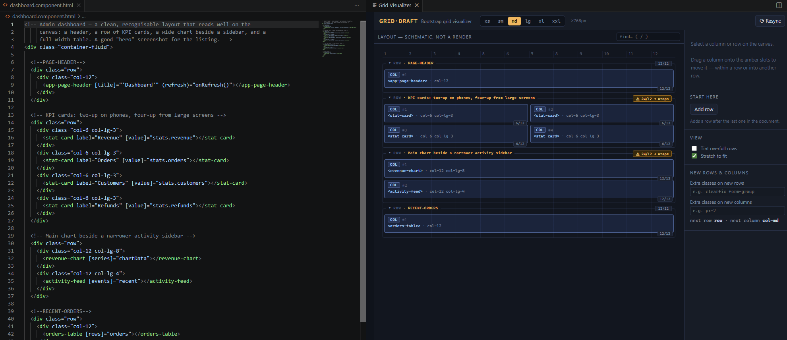
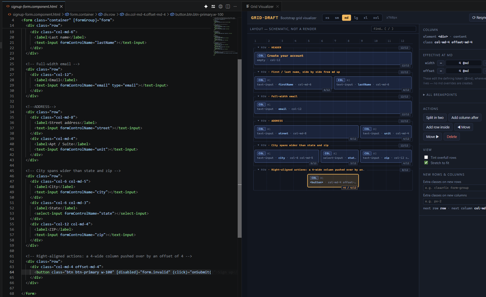
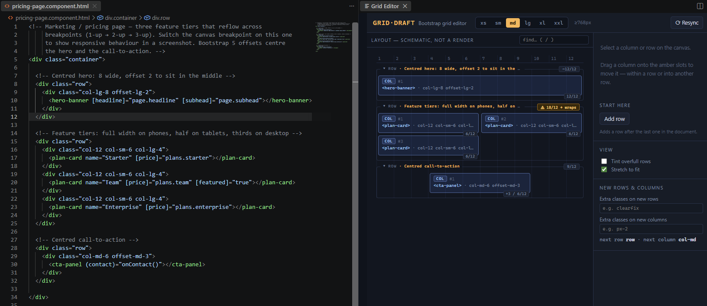
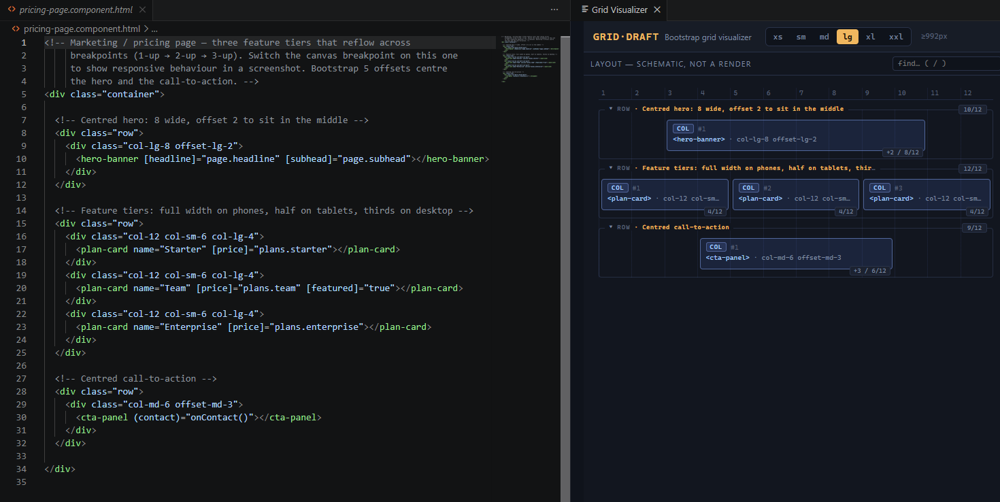
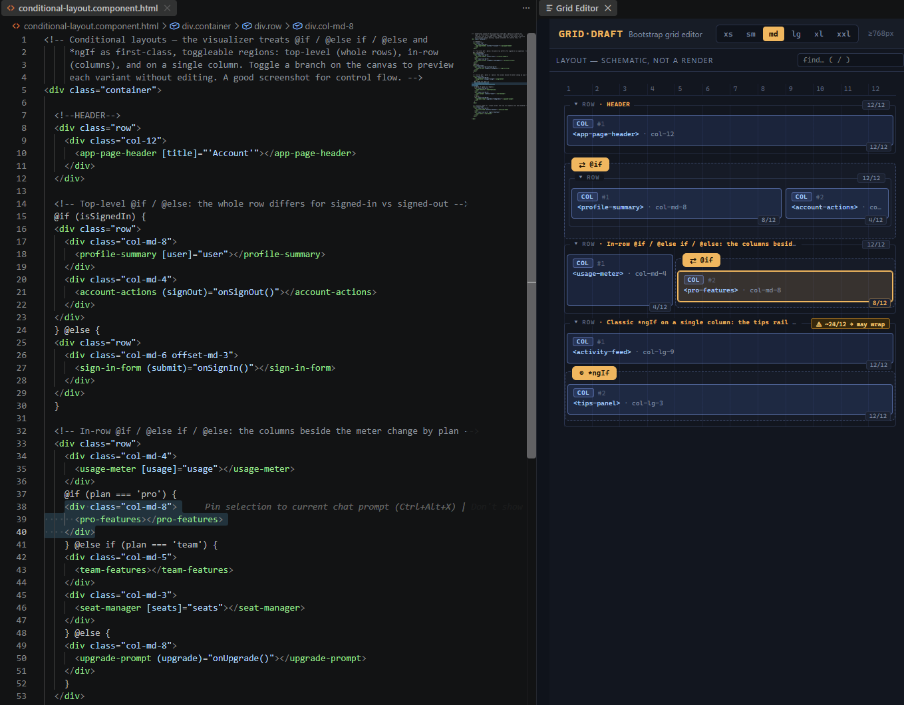
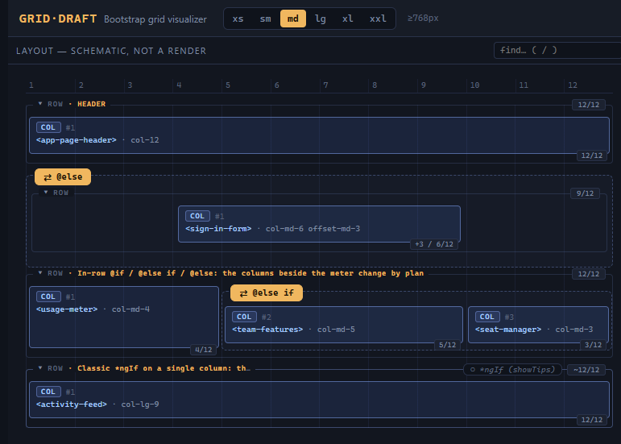

# Bootstrap Grid Visualizer

Edit your Bootstrap grid the way you think about it — as columns and rows, not
class strings. This VS Code extension renders a live schematic of the grid in any
HTML or Angular template and lets you resize, split, move, and offset columns on
a canvas, writing every change back to the document **surgically**: only the
classes you touched change, and your formatting, comments, and Angular
directives are preserved byte-for-byte.

## Features

- **A schematic canvas** of your template's grid, beside the editor.
- **Direct manipulation** — drag to resize, split a column, drag-and-drop to
  move, and set offsets with the inspector steppers.
- **Surgical edits** — changes touch only the affected class attribute (or move
  an element with its adjacent title comment). The rest of your source is never
  reformatted or regenerated.
- **Two-way selection** — click a column to reveal its source; move the editor
  caret to select the matching block on the canvas.
- **Conditionals are first-class** — `@if` / `@else` / `@else if` and `*ngIf`
  regions show up as toggleable branches you can preview.
- **Breakpoint switching** — see the layout at xs–xxl without editing anything.
- **Live sync** — the canvas follows the editor as you type (toggleable).
- **Bootstrap 3, 4, and 5** — the dialect is detected per file; new columns
  follow whatever the file already uses.

## Use

1. Open an HTML / Angular template with `.row` / `col-*` markup.
2. Run **Open Grid Visualizer** — from the command palette, the editor title bar
   (the grid icon on `.html` files), or the right-click menu.
3. A canvas opens beside the editor:
   - Click a column/row to select it; the matching source is revealed, and
     moving the editor caret selects the matching block back.
   - Edit with the inspector steppers, drag-resize, or drag-and-drop.
   - Edits apply to the **editor buffer immediately** — press **Ctrl+S** to
     save. Undo with the editor's normal **Ctrl+Z**.
   - If live sync is off and you edit the document directly, the canvas flags a
     mismatch; click **⟳ Resync** (or save) to refresh it.

Select a column and the inspector gives you width and offset steppers per
breakpoint, plus split, add, move, and delete — all writing back to the source:

## Responsive, at a glance

Switch the canvas breakpoint to see how the layout reflows — no editing, no
guessing. The same pricing page at `md` (tiers wrap two-up) and `lg` (three-up):

<table>
  <tr>
    <td></td>
    <td></td>
  </tr>
  <tr>
    <td align="center"><code>md</code> — two-up, the third wraps</td>
    <td align="center"><code>lg</code> — three across</td>
  </tr>
</table>

## Conditional layouts

`@if` / `@else if` / `@else` and `*ngIf` aren't flattened away — they show up as
labelled, toggleable regions (top-level rows, in-row columns, or a single
column). Flip a branch on the canvas to preview that variant without touching the
source. The same account page with its branches toggled:

<table>
  <tr>
    <td></td>
    <td></td>
  </tr>
  <tr>
    <td align="center"><code>@if</code> · <code>pro</code> · tips on</td>
    <td align="center"><code>@else</code> · <code>@else if (team)</code> · tips off</td>
  </tr>
</table>

## Settings

All under `bootstrapVisualizer.*`:

| Setting | Default | What it does |
|---|---|---|
| `defaultBreakpoint` | `md` | Breakpoint the canvas opens at. |
| `stretchToFit` | `false` | Open stretched to the full panel instead of the breakpoint's representative width. |
| `tintOverfullRows` | `false` | Open with overfull rows tinted amber. |
| `dialect` | `bootstrap5` | Class style for **new** columns when a file has no grid classes to detect from (`bootstrap5` or `bootstrap3`). A file that already uses a dialect keeps it. |
| `newRowClasses` | `""` | Extra classes on every row the canvas **creates**, after `row` — e.g. `clearfix form-group`. Workspace-scoped, so commit it in `.vscode/settings.json` and the whole team gets it. Grid classes are ignored here. |
| `newColumnClasses` | `""` | Extra classes on every column the canvas **creates**, after the computed `col-*` — e.g. `px-2`. Also workspace-scoped. |
| `liveSync` | `true` | Keep the canvas in sync with the editor as you type. Off = the canvas holds still until you save or **Resync**. Either way, canvas edits are verified against the file before they touch it. |

## Scope & privacy

- **HTML-only.** It reads the template and writes classes back. It never runs
  your toolchain, spawns a process, or reads outside the open document.
- **No telemetry, no network.** The extension collects nothing and makes no
  network requests.

## Known issues

- This build bundles the Angular template compiler into the webview, so the
  panel is a little heavy to load; a lighter build is planned.

Found a bug? The most useful thing you can include is a **minimal template
snippet that reproduces it** —
[open an issue](https://github.com/Solus/bootstrap-grid-editor/issues).

---

If this saves you time, you can
[sponsor its development](https://github.com/sponsors/Solus). Thanks!
